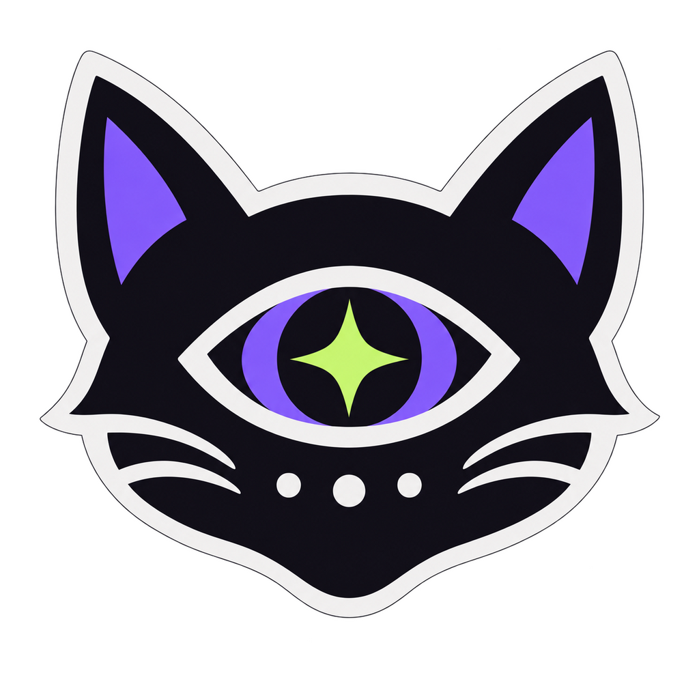

<div align="center">
  

# Daniel Hernández — Developer Portfolio

**A bilingual, interactive portfolio connecting full-stack development, game development and experience design.**

[LinkedIn](https://www.linkedin.com/in/daniel-hernandez-tamayo/) · [GitHub](https://github.com/DanielHernandez131)
</div>

## About the project

This portfolio presents my work and background as a Full-Stack Developer and Game Developer. It brings both sides of my profile together through a responsive interface inspired by code editors, interactive systems and the duality of Schrödinger's cat.

The experience includes selected projects, professional and academic background, technologies, social profiles and a direct contact form. Visitors can switch between Spanish and English, as well as between two professional profiles with their own visual identity: lime for Full-Stack and dark violet for Game Development.

## Highlights

- Fully responsive layout for desktop and mobile devices.
- Spanish and English content without page reloads.
- Interactive Full-Stack and Game Development profile switcher.
- Dynamic lime and violet colour themes.
- Expandable project details with independent controls.
- Accessible semantic markup and keyboard-friendly interactions.
- Contact form that prepares a pre-filled email without requiring a backend.
- React components, Tailwind CSS utilities and custom CSS, built with Vite. No router, UI kit or translation library.

## Featured projects

### Place Between

A wellbeing web application designed around a **Day → Night → Mirror** routine. It combines guided activities, emotional check-ins, goals and progress visualisation in a clear and approachable experience.

**Technologies:** React, JavaScript, Python, Flask, SQLAlchemy and JWT.

### Oniria

A game concept that explores emotions as gameplay mechanics, inspired by Plutchik's wheel of emotions. The project connects game design, emotional intelligence and an emotion-driven combat system.

**Technologies:** Unity, C#, game design and mechanics design.

## Technology overview

| Area             | Technologies                                              |
| ---------------- | --------------------------------------------------------- |
| Frontend         | React, JavaScript, HTML5, CSS3, Bootstrap, Tailwind, Vite |
| Backend          | Python, Flask, MongoDB, SQL, REST APIs, JWT               |
| Game Development | Unity, C#, Java, C++, game design, mechanics design       |

This portfolio itself uses React 19, Tailwind CSS 4 and Vite 7. The technologies listed in the table describe my professional toolkit, not additional dependencies of this website.

## Run locally

Install Node.js 22.12+ (22.x) or Node.js 24+ and npm. From the repository folder:

```bash
npm ci
npm run dev
```

Open the local URL printed by Vite. No backend or environment variables are required.

```bash
npm run build    # Generate the static website in dist/
npm run preview  # Preview the production build locally
npm test         # Check translations, project data and email encoding
```

Deploy the contents of `dist/` to a static host. Vite uses relative asset URLs so the build can also be hosted in a repository subdirectory. Opening `index.html` directly or serving the source with Python no longer runs the application; use Vite during development.

## Publish to GitHub Pages

The workflow in `.github/workflows/deploy.yml` runs tests, builds the website and deploys it whenever changes reach `main`.

1. In the GitHub repository, open **Settings → Pages** and select **GitHub Actions** under **Build and deployment → Source**.
2. Commit and push the workflow and portfolio source to your working branch.
3. Open a pull request targeting `main` and merge it after review.
4. Open **Actions → Deploy portfolio to GitHub Pages** and wait for both jobs to succeed. The deployment summary provides the published URL.

Expected URL: https://danielhernandez131.github.io/DanielHernandez_PortfolioWeb/

The workflow uses Node.js 24 and builds with the repository path as Vite's base URL. Local builds retain relative asset paths. If the repository is renamed or a custom domain is configured, update the workflow's `--base` argument accordingly. `dist/` and `node_modules/` remain ignored; GitHub generates the deployment artifact from source.

Once the workflow exists on `main`, **Actions → Deploy portfolio to GitHub Pages → Run workflow** can also trigger a deployment from `main`.

## Project structure

```text
.
├── assets/images/cat-eye-logo.png
├── src/
│   ├── components/       # Page sections, project cards, profile window and shared UI
│   ├── data/
│   │   ├── translations.js  # Spanish and English text
│   │   ├── projects.js      # Project metadata and translation keys
│   │   └── contact.js       # Email address and mailto builder
│   ├── styles/
│   │   ├── index.css        # Tailwind and CSS layer imports
│   │   ├── base.css         # Global foundations and theme variables
│   │   └── components.css   # Bespoke visuals and responsive refinements
│   ├── App.jsx          # Language/profile state and page composition
│   └── main.jsx         # React entry point
├── tests/content.test.js
├── index.html
├── package.json
├── package-lock.json
├── vite.config.js
└── README.md
```

## Code review guide

Start with `src/App.jsx` for page composition and shared language/profile state, then follow the section components. `SectionHeading` and the project card keep repeated markup consistent; project content and translations live in `src/data/`.

- **State:** props carry the active dictionary and profile. Only document language and the CSS theme need effects; form fields and project disclosures use native browser state.
- **Rendering:** rich translations and profile snippets render as React text/elements, without injected HTML.
- **Styling:** Tailwind owns common layouts; custom CSS covers the portfolio's visual identity. CSS layers let utilities override component styles intentionally.
- **Dependencies:** React handles the UI; Vite and Tailwind are build tools. Translation, disclosure and email handling use local code and browser APIs.
- **Validation:** `npm test` checks translation parity, project references and email encoding. `npm run build` validates the production bundle; visual and interaction checks still require a browser.

Edit source files in `src/`. `dist/` is generated by `npm run build`, and `node_modules/` is installed by npm; both are ignored by Git. Comments document intent, constraints and browser behavior rather than restating JSX.

## Customisation

### Content and languages

All translated text lives in `src/data/translations.js`. Add each new key to both `es` and `en`. Components receive the active dictionary as `t`; language and profile state live in `App.jsx`. Form input and expanded project details remain in place when switching languages.

`RichText` supports the existing `<strong>` and `<br>` markers as React elements without injecting HTML. The profile code window shares one template per profile and translates its comments and lists.

### Adding a project

1. Add an entry with a unique `id` to `src/data/projects.js`.
2. Set `name`, the `role` and `summary` translation keys, `tags`, and the `details` array of `{ title, text }` translation keys. Tags use either `{ label: "React" }` or `{ translation: "mechanics" }`.
3. Add the referenced text in both languages in `translations.js`.
4. For bespoke artwork, add a variant in `ProjectVisual.jsx` and set the entry's `visual` field. Omit `visual` for a text-only card.
5. Run `npm test` and `npm run build`, then check both languages on desktop and mobile.

The project grid and card markup are shared; new cards do not require duplicating the section.

### Styling and responsive layout

Tailwind utilities handle common grid and flex layouts directly in JSX. Custom CSS preserves the original typography, project artwork and code window. Tailwind Preflight is intentionally omitted to retain the original browser defaults.

Theme variables live in `src/styles/base.css`. Full-Stack uses lime; `body[data-stack="game"]` overrides them for the violet theme. The original 720px, 900px and 1000px layout thresholds are retained, with additional wrapping for narrow mobile screens. Focus indicators and reduced-motion preferences remain supported.

### Contact

The form prepares a pre-filled email using `mailto:` and the visitor's email application; it does not send or store submissions. Edit the recipient in `src/data/contact.js`. Direct submission would require a form service or backend.

## Contact

I am open to opportunities and collaborations in full-stack development, frontend development and game development.

- [LinkedIn](https://www.linkedin.com/in/daniel-hernandez-tamayo/)
- [GitHub](https://github.com/DanielHernandez131)
- [d.hernandezt.96@gmail.com](mailto:d.hernandezt.96@gmail.com)

## License and brand notice

The source code in this repository is licensed under the [MIT License](LICENSE), unless otherwise stated.

The logo, visual identity, written portfolio content, personal information, project artwork and screenshots are © 2026 Daniel Hernández. These materials are **not** covered by the MIT License and may not be copied, redistributed or used to represent another person, product or organisation without prior written permission. All rights reserved.
